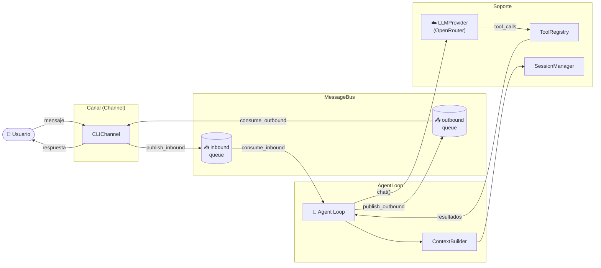
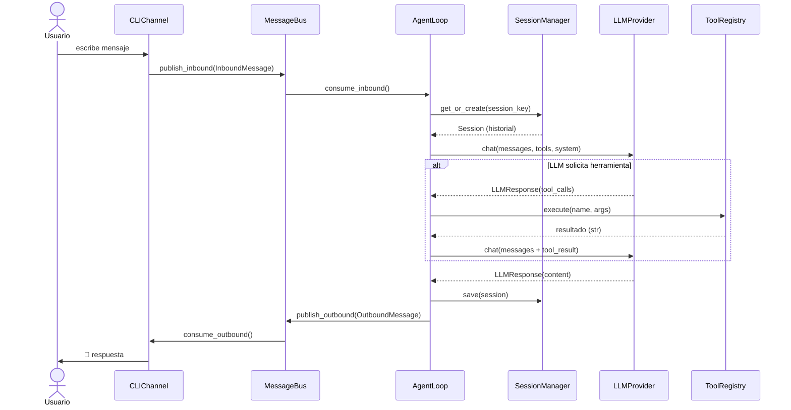

# Femtobot — Plantilla mínima para agentes conversacionales en Python (inspirado en "nanobot")

[](https://github.com/rafnixg/femtobot/actions/workflows/build-doc.yml)
[](https://www.python.org/downloads/)
[](https://rafnixg.github.io/femtobot/femtobot.html)


Femtobot —inspirado en el post y la arquitectura de `nanobot`— es un ejemplo educativo y minimalista de cómo organizar un agente conversacional en capas. Resume ideas prácticas para construir un agente pequeño, extensible y fácil de entender y sirve como plantilla didáctica para experimentar con prompts, tools y gestión de sesiones.

Recuerda que no es un framework ni una librería, sino un ejemplo de referencia para aprender y prototipar. No está diseñado ni preparado para producción, y carece de muchas características necesarias para un despliegue real (persistencia, seguridad, robustez, etc.). Sin embargo, es un buen punto de partida para entender los conceptos clave y experimentar con agentes conversacionales en Python.

["nanobot — arquitectura y funcionamiento del agente IA ultra ligero"](https://blog.rafnixg.dev/nanobot-arquitectura-y-funcionamiento-del-agente-ia-ultra-ligero) (Post con explicación detallada de la arquitectura, diseño y código de referencia).

## Resumen rápido

- Flujo asíncrono basado en `asyncio.Queue` para desacoplar productores (canales) y consumidores (el agente).
- Bucle de agente que combina llamadas a un LLM con la ejecución de *tools* (funciones auxiliares) y reinyecta sus resultados al LLM.
- Gestión de sesiones en memoria para conservar historial y construir contexto para el LLM.

## Arquitectura



## Flujo del agente (secuencia)



## Componentes principales

| Componente | Clase(s) | Responsabilidad |
|---|---|---|
| **Canal** | `Channel`, `CLIChannel` | Interfaz de entrada/salida. Publica `InboundMessage` y consume `OutboundMessage`. |
| **Bus de mensajes** | `MessageBus` | Cola central asíncrona que desacopla canales del agente. |
| **Bucle del agente** | `AgentLoop` | Orquesta el flujo: contexto → LLM → tools → respuesta. |
| **Constructor de contexto** | `ContextBuilder` | Ensambla el system prompt y el historial para cada llamada al LLM. |
| **Herramientas** | `Tool`, `ToolRegistry` | Define y registra capacidades invocables por el LLM (ej.: `get_datetime`). |
| **Sesiones** | `Session`, `SessionManager` | Almacena el historial de conversación por sesión en memoria. |
| **Proveedor LLM** | `LLMProvider`, `OpenRouterProvider` | Adaptador para llamar a modelos de lenguaje vía OpenRouter/OpenAI. |

## Por qué esta aproximación

- Desacopla entrada/salida y lógica del agente → mejor testabilidad.
- Permite que el LLM use herramientas de forma controlada y auditable.
- Mantiene el diseño simple y modular, ideal para prototipado rápido.

## Estructura del proyecto

```
femtobot/
├── femtobot.py          # Código principal (todos los componentes)
├── requirements.txt     # Dependencias de runtime
├── tests/
│   └── test_femtobot.py # Tests unitarios (pytest)
└── .github/
    └── workflows/
        └── build-doc.yml  # CI: genera y publica documentación en GitHub Pages
```

## Uso rápido

### Linux / macOS

1. Instala dependencias:

```bash
pip install -r requirements.txt
```

2. Define la clave de API (necesaria para usar OpenRouter):

```bash
export OPENROUTER_API_KEY="sk-or-v1-..."
```

> Obtén una clave gratuita en [openrouter.ai/keys](https://openrouter.ai/keys).

3. Ejecuta el demo:

```bash
python femtobot.py
```

### Windows

<details>
<summary>PowerShell / CMD — haz clic para expandir</summary>

**PowerShell (sesión actual):**

```powershell
$env:OPENROUTER_API_KEY = 'sk-or-v1-...'
python femtobot.py
```

**PowerShell (persistente, requiere reiniciar la sesión):**

```powershell
setx OPENROUTER_API_KEY "sk-or-v1-..."
```

**CMD (sesión actual):**

```cmd
set OPENROUTER_API_KEY=sk-or-v1-...
python femtobot.py
```

</details>

## Ejemplo de sesión

```text
Tú: ¿Qué hora es?

🤖 femtobot: Fecha y hora actual: 2026-03-29 14:23:10
```

El ciclo completo: entrada → `MessageBus` → `AgentLoop` → tool `get_datetime` → resultado → respuesta al usuario.

## Pruebas

```bash
pip install pytest
pytest -q
```

Los tests cubren `DateTimeTool`, `MessageBus`, `ToolRegistry` y `SessionManager` (cobertura parcial; `AgentLoop`, `ContextBuilder` y `Channel` no tienen tests todavía).

## Extender el proyecto

- Añadir persistencia para `SessionManager` (archivo, SQLite, Redis…)
- Implementar nuevos `Channel` (Telegram, Discord, HTTP/webhook)
- Agregar más `Tool` (APIs externas, búsquedas, ejecución de comandos)
- Reemplazar `OpenRouterProvider` por otro proveedor (Anthropic, OpenAI, local)

## Referencias

- Documentación API: [rafnixg.github.io/femtobot/femtobot.html](https://rafnixg.github.io/femtobot/femtobot.html)
- Post conceptual: [nanobot — arquitectura y funcionamiento](https://blog.rafnixg.dev/nanobot-arquitectura-y-funcionamiento-del-agente-ia-ultra-ligero)

## Licencia

Demo educativo — libre para uso y modificación.

## Limitaciones

- Proyecto educativo y minimalista; no está diseñado ni preparado para entornos de producción.
- Persistencia: las sesiones se guardan solo en memoria; no hay persistencia duradera ni respaldo.
- Robustez: manejo limitado de errores, reintentos y control de límites (rate limits, circuit breakers).
- Seguridad: no hay autenticación, control de acceso, ni sanitización/screening completa de entradas y salidas.
- Ejecución de herramientas: las `Tool` se ejecutan sin sandboxing ni restricciones de seguridad.
- Escalabilidad: no probado para carga, concurrencia alta ni despliegue distribuido.
- Observabilidad: faltan métricas, logs estructurados, trazas y alertas.
- Configuración de modelos y costes: falta gestión avanzada de modelos, caching y optimización de coste.

## Advertencia — No usar en producción

Este repositorio es un ejemplo didáctico. No lo despliegues en producción ni proceses datos sensibles con él sin una revisión exhaustiva y la implementación de controles de seguridad, privacidad y resiliencia. Antes de cualquier uso productivo, añade autenticación, control de acceso, persistencia segura, sanitización de datos, pruebas de carga y mecanismos de mitigación (rate limits, retries, circuit breakers, sandboxing para herramientas).

### Qué falta respecto a `nanobot`

El post y `nanobot` contienen varias consideraciones avanzadas y características que aquí por simplificacion no se consideran.
Entre las principales diferencias en funcionalidades y características que faltan en `femtobot` respecto a `nanobot` se incluyen:

- Persistencia avanzada: almacenamiento de memoria a largo plazo (archivos, SQLite, Redis, vector DBs).
- Memoria y recuperación: mecanismos de indexación, embeddings y recuperación semántica para contexto a largo plazo.
- Plantillas de prompts y gestor de roles: sistema para versionar y parametrizar prompts y prompts de sistema.
- Evaluación y benchmarks: harness de evaluación automática, métricas de calidad y pruebas A/B de prompts.
- Seguridad y moderación: filtros de contenido, verificación y sanitización, y políticas de seguridad.
- Sandboxing de herramientas: ejecutar llamadas externas de forma aislada y limitada.
- Streaming y respuestas parciales: compatibilidad con respuestas por streaming del modelo.
- Orquestación de modelos: selección y conmutación entre modelos, fallback y mezcla de modelos.
- Caché y optimizaciones: caching de respuestas, deduplicación y batching de llamadas.
- Operaciones y observabilidad: métricas, logs estructurados, tracing (OpenTelemetry).
- Tests y CI avanzados: linters, type checks (mypy), pruebas de integración, y pruebas de seguridad.
- Integraciones de canales: ejemplos para Telegram, Discord, Webhooks/HTTP y otros canales reales.
- Gestión de costos y límites: herramientas para controlar consumo y gasto en APIs LLM.
